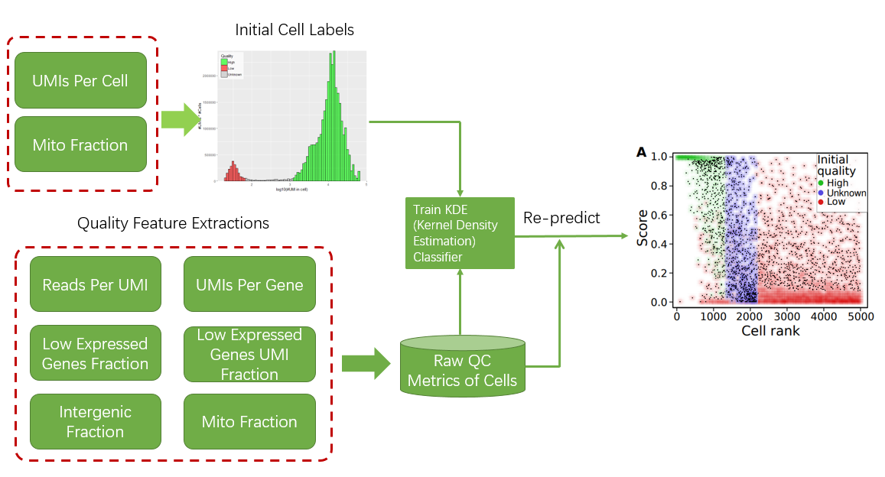

[](https://travis-ci.org/github/kharchenkolab/dropestr)


# dropestr
Perform UMI count corrections, and filtration of low-quality cells. Part of [dropEst](https://github.com/hms-dbmi/dropEst)

Please see the vignettes:
* [UMI Correction](https://htmlpreview.github.io/?https://raw.githubusercontent.com/kharchenkolab/dropestr/master/doc/umi-correction.html)
* [Filtration of Low-Quality Cells](https://htmlpreview.github.io/?https://raw.githubusercontent.com/kharchenkolab/dropestr/master/doc/low-quality-cells.html)
* [Quality Control](https://htmlpreview.github.io/?https://raw.githubusercontent.com/kharchenkolab/dropestr/master/doc/report.html)

## Installation

```r
devtools::install_github('kharchenkolab/dropestr')
```

## Cell Filtration Procedure

<p align="center">
  
</p>


## Citation 

If you find this software useful for your research, please cite the corresponding [paper](https://genomebiology.biomedcentral.com/articles/10.1186/s13059-018-1449-6):

Petukhov, V., Guo, J., Baryawno, N., Severe, N., Scadden, D. T., Samsonova, M. G., & Kharchenko, P. V. (2018). dropEst: pipeline for accurate estimation of molecular counts in droplet-based single-cell RNA-seq experiments. Genome biology, 19(1), 78. doi:10.1186/s13059-018-1449-6